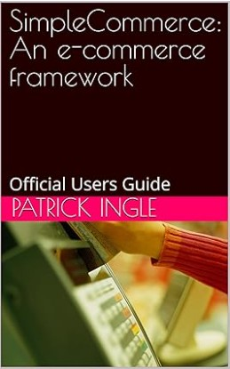

# simplecommerce
A lightweight, open-source eCommerce framework that integrates Stripe for products, payments, and customer data, prioritizing security and simplicity. With no PII stored on public servers, role-based extensibility, and zero paywalls, SimpleCommerce is the hassle-free solution for modern online stores. 

## Prerequities

- PHP 7.x
- PHP Sqlite3 module enabled
- PHP curl module enabled
- composer stripe library (included)


## **Quickstart Guide for WSL**
This guide walks you through setting up **SimpleCommerce** on **Windows Subsystem for Linux (WSL)**.

---

### **1. Install WSL**  
Open **PowerShell as Administrator** and run:  
```powershell
wsl --install
```
If you already have WSL installed, make sure it's up to date:  
```powershell
wsl --update
```
Restart your PC if prompted.

---

### **2. Install PHP & Required Components**  
Launch **WSL** and install the necessary dependencies:  
```bash
sudo apt update && sudo apt upgrade -y
sudo apt install -y php php-cli php-sqlite3 unzip curl git composer
```

---

### **3. Clone SimpleCommerce Repository**  
Navigate to your preferred directory and clone the repo:  
```bash
cd ~
git clone https://github.com/pingleware/simplecommerce.git
cd simplecommerce
```

---

### **4. Start WSL from the Project Directory**  
To quickly launch WSL in this directory from **Windows**, run:  
```powershell
wsl ~ -d Ubuntu -e bash -c "cd ~/simplecommerce && bash"
```

---

### **5. Install Dependencies**  
Inside WSL, run:  
```bash
composer update
```

---

### **6. Start the Development Server**  
Run the built-in PHP server:  
```bash
php -S localhost:8080 -t .
```
Your SimpleCommerce site is now running at:  
🔗 [http://localhost:8080](http://localhost:8080)

---


## Features

- No personal identifying information kept on public server
- Stripe payment and product inventory hosting
- Gift card purchase between giver and receiver
- Coupons and promotion codes for periodic discounts
- Newsletter creation and subscription containing selected products
- ShipStation integration
- USPS click-n-ship export
- Sitemap and robots.txt creation

## Hosting
Business internet with a static IP is **preferred** because you have total control and responsibility of the hardware and software.

### Basic Self Hosting Setup
- Business internet with static ip (COX, Verizon, AT&T)
- Wifi Router with POE ports (or Wifi Router + POE switch)
- Raspberry Pi Model 4 B+ with 8 GB Ram
- Raspberry Pi POE hat
- 120GB to 1TB micro SD card

*The latest firmware on the Raspberry PI 4B+ permits bootloading installation of the operating system

1. Connect Coax Cable -> Cable Modem -> Wifi Router -> POE switch -> Raspberry PI with POE hat and microSD card installed
2. Turn on Cable modem, wifi router
3. Connect a computer directly to the router
4. Configure Wifi router with the static IP and DNS provided by your ISP
5. Connect a keyboard and monitor to the Raspberry Pi 4B+
6. Turn on POE switch
7. Enter Raspberry Pi boot loaded to install OS, choose Ubuntu and enable ssh-server
8. After installation, reboot and remote connect via SSH
9. Perform **sudo apt update && sudo apt upgrade -y**
10. Install apache, git and the other prerequsities above
11. Clone the simplecommerce repository under the **/var/www/html** directory
12. Create a new apache virtual host using the DocumentRoot pf /var/www/html/simplecommerce
13. Enable mod_rewrite, **a2enmod rewrite**
14. Restart apache
15. Access your ecommerce from the browser

## Official User Guide

[](https://www.amazon.com/dp/B0DWQLKLCP)

## Live Preview

[my-buy-it-now.com](https://my-buy-it-now.com)

## In the News
While SimpleCommerce is **NOT** mention the following articles, they do mention eCommerce as a viable business.

- [The Best Side Hustles To Start In 2025 For Maximum Profitability](https://www.forbes.com/sites/melissahouston/2025/02/07/the-best-side-hustles-to-start-in-2025-for-maximum-profitability/)
- [15 most profitable ecommerce business ideas in 2025](https://www.omnisend.com/blog/ecommerce-business-ideas/)
- [15 Niche Ecommerce Business Ideas You Can Bank On](https://www.ecommerceceo.com/ecommerce-business-ideas/)
- [is e-commerce worth it with little or no capital, seems very oversaturated](https://www.reddit.com/r/ecommerce/comments/vjl3he/is_ecommerce_worth_it_with_little_or_no_capital/)
- [Is E-commerce viable business](https://makorlah.com/blogs/news/is-e-commerce-viable-business)
